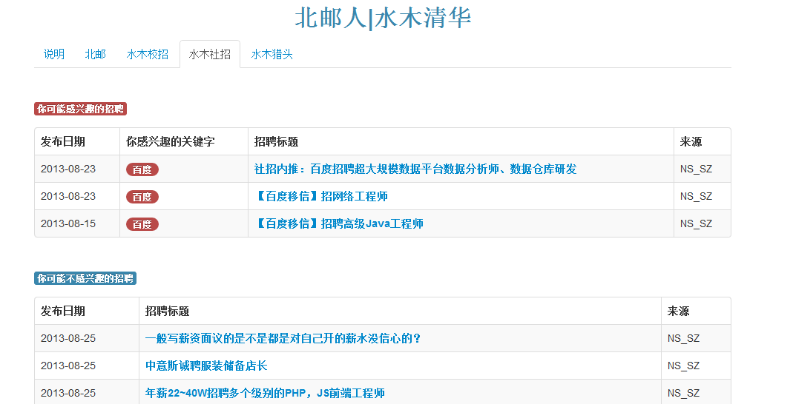

Crawler_Job
===========
----------
#### 简介：

Crawler_Job是获取北邮人以及水木清华论坛招聘信息的爬虫  
Crawler_Job使用Python编写，Python版本号为3.3.2

#### 实现方案：

北邮人和水木清华使用同一种BBS系统，爬取工作能够复用  
可配置感兴趣的关键词，使用简单的字符串查询招聘标题中是否含有关键词:  
```javascript
def title_contain_keyword(self,tgt_title):
    return list(filter(lambda keyword : keyword in tgt_title, self.title_keyword))    
```
同样也可以关键字来过滤掉一些招聘信息，或者是一些管理员发的取消权限的水贴：
```javascript
def filter_limit_keyword_in_title(self,tgt_title):
    if list(filter(lambda keyword : keyword in tgt_title, self.limit_keyword)):
		return False
	else:
		return True    
```
招聘信息是按照发布时间先后排序  
感兴趣的招聘信息没有显示的条数限制  
而不感兴趣的招聘信息（**除了感兴趣和过滤点的以外**）的显示条数是需要通过配置来限制  
不同页面显示模板可以通过修改以下文件来实现  
`html_model.html list_content.html`


#### 环境搭建
本项目在Win7 x64下测试可运行，在Python3的基础下还需要以下依赖包： 

    easy_install BeautifulSoup4  
    easy_install apscheduler  
    easy_install redis

这里还需要安装Redis数据库，Win下安装Redis可能不是很方便，这是下载链接[Redis下载链接](http://code.google.com/p/servicestack/wiki/RedisWindowsDownload#Download_32bit_Cygwin_builds_for_Windows),而Redis在Python下的接口[详见](http://redis-py.readthedocs.org/en/latest/)  

#### 运行：

    redis-server.exe  
    python crawler.py

#### 效果图:


